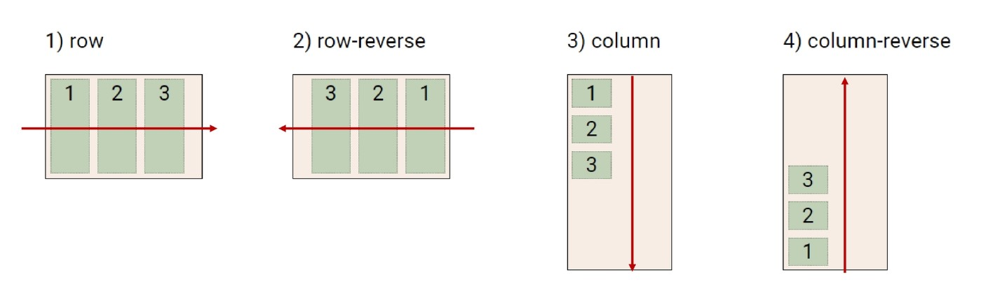

# Web: 그리드 시스템/반응형 웹

[toc]


## CSS Layout

- float 1996
- flexbox 2012 : 큰 변화를 일으킴


### Float

> 어떤 요소를 감싸는 형태로 배치하고 싶을 때
>
> 좌/우측에 배치는 어떻게?


#### CSS 원칙Ⅰ

- 블록 : margin
  - div, h1, p
- 인라인 : 양옆 마진은 가능. 위아래 마진 불가능
  - span, input, img(독특한 성질 갖고 있음)


- 박스를 왼쪽 혹은 오른쪽으로 이동시켜 텍스트를 포함 인라인요소들이 주변을 wrapping 하도록 함

- 요소가 Normal flow를 벗어나도록 함
  - positioning -> absloute(static이 아닌 부모 기준) / fixed(viewport기준)


#### Float 속성

- **none** : 기본값

- **left** : 요소를 왼쪽으로 띄움

- **right** : 요소를 오른쪽으로 띄움

- 기본 구조 : header / side bar / main content / footer

  ex) 구글 뉴스, 쇼핑몰


#### Float 예시Ⅰ

```html
<!DOCTYPE html>
<html>
    <head>
        <meta>
        <style>
            .box {
                width: 10rem;
                height: 10rem;
            }
        </style>
    </head>
    <body>
        <h1>float</h1>
        <div class="box">box</div>
    </body>
</html>
```


#### Float 예시Ⅱ

```html
    <style>
        .box {
            /* 10rem => 160px (root -> 16px) */
            width: 10rem;
            height: 10rem;
            border: 1px solid black;
            background-color: cornflowerblue;
        }

        .left {
            float: left;
        }

        .right {
            float: right;
        }
    </style>
</head>
<body>
    <h1>float</h1>
    <div class="box left">left</div>
    <div class="box right">right</div>
```


#### Clearing Float

- Float는 Normal Flow에서 벗어나 부동 상태(떠 있음)
- 따라서, 이후 요소에 대하여 Float 속성이 적용되지 않도록 Clearing이 필수적
  - ::**after** : 선택한 요소의 맨 마지막 자식으로 가상 요소를 하나 생성
    - 보통 content 속성과 함께 짝지어, 요소에 장식용 콘텐츠를 추가할 때 사용
  - clear 속성 부여 (부모 요소에게)

```html
        .clearfix::after {
            content: "";
            display: block;
            clear: both;
        }
```

```html
    <div class="clearfix">
        <div class="box1 left">box1</div>
    </div>
    <div class="box2">box2</div>
```


### Flexbox

#### CSS Flexible Box Layout

- 행과 열 형태로 아이템들을 배치하는 1차원 레이아웃 모델 => main axis를 기준으로 함
- 축
  - main axis(메인 축)
  - cross axis(교차 축)
- 구성 요소
  - Flex Container (부모 요소)
  - Flex Item (자식 요소)

수동 값 부여 없이

1. 수직 정렬
2. 아이템의 너비와 높이 혹은 간격을 동일하게 배치


#### Flexbox 축

- flex-direction : row
- flex-direction : column


#### Flexbox 구성 요소

- Flex Container (부모 요소)

  - flexbox 레이아웃을 형성하는 가장 기본적인 모델

  - Flex Item들이 놓여있는 영역
  - display 속성을 flex혹은 inline-flex로 지정
- Flex Item (자식 요소)

  - 컨테이너에 속해 있는 컨텐츠 (박스)

```css
.flex-container {
    display: flex;
}
```


#### Flex 속성

- 배치 설정
  - flex-direction
  - flex-wrap
- 공간 나누기
  - justify-content (main axis)
  - align-content (cross axis)
- 정렬
  - align-items
  - align-self


#### Flexbox 속성: flex-direction

- main axis 기준 방향 설정
- 역방향의 경우 HTML 태그 선언 순서와 시각적으로 다르니 유의 (웹 접근성에 영향)

1. row
2. row-reverse
   - 메인 축은 가로. 오른쪽에서 왼쪽으로
3. column
4. column-reverse



```html
<div class="example">
        <p>1) row</p>
        <div class="flex_container flex_direction_row">
          <div class="flex_item">1</div>
          <div class="flex_item">2</div>
          <div class="flex_item">3</div>
        </div>
      </div>
      <div class="example">
        <p>2) row-reverse</p>
        <div class="flex_container flex_direction_row_reverse">
          <div class="flex_item">1</div>
          <div class="flex_item">2</div>
          <div class="flex_item">3</div>
        </div>
      </div>
      <div class="example">
        <p>3) column</p>
        <div class="flex_container flex_direction_column">
          <div class="flex_item">1</div>
          <div class="flex_item">2</div>
          <div class="flex_item">3</div>
        </div>
      </div>
      <div class="example">
        <p>4) column-reverse</p>
        <div class="flex_container flex_direction_column_reverse">
          <div class="flex_item">1</div>
          <div class="flex_item">2</div>
          <div class="flex_item">3</div>
        </div>
      </div>
```

※ `div.d-none.d-md-block` = `<div class="d-none d-md-block">`

※ 클래스 명시 순서는 의미x

※ ctrl + alt => multi-selecting

※ 코드드래그 + alt + 방향키 => 코드 이동


#### Flexbox 속성: flex-wrap

- 아이템이 컨테이너를 벗어나는 경우 해당 영역 내에 배치되도록 설정


#### Flexbox 속성: flex-direction & flex-wrap

- flex-direction : main axis의 방향을 설정

- flex-wrap: 요소들이 강제로 한 줄에 배치되게 할 것인지 여부 설정

  - nowrap (기본값) : 한 줄에 배치

  - wrap : 넘치면 그 다음 줄로 배치

- **flex-flow**

  - flex-direction과 flex-wrap의 shorthand

  - flex-direction과 flex-wrap에 대한 설정 값을 차례로 작성

    ex) `flex-flow: row nowrap;`


#### Flexbox 속성: justify-content

- **main axis를 기준**으로 공간 배분


1. flex-start(기본값) : 남은 영역을 오른쪽에
2. flex-end : 남은 영역을 왼쪽에
3. center : 남은 영역을 양쪽에
4. space-between : 아이템 사이에 균등하게 남은 영역 배분
5. space-around : 아이템이 갖는 남은 영역의 크기가 같음. 아이템을 둘러싼 영역을 균일하게 분배
6. space-evenly : 남은 영역 동일하게 배분. 전체 영역에서 아이템 간 간격을 균일하게 분배

```html
    <div id="justify_content" class="example_container">
      <div class="example">
        <p>1) flex-start</p>
        <div class="flex_container flex_justify_content_flex_start">
          <div class="flex_item">1</div>
          <div class="flex_item">2</div>
          <div class="flex_item">3</div>
        </div>
      </div>
      <div class="example">
        <p>2) flex-end</p>
        <div class="flex_container flex_justify_content_flex_end">
          <div class="flex_item">1</div>
          <div class="flex_item">2</div>
          <div class="flex_item">3</div>
        </div>
      </div>
      <div class="example">
        <p>3) center</p>
        <div class="flex_container flex_justify_content_center">
          <div class="flex_item">1</div>
          <div class="flex_item">2</div>
          <div class="flex_item">3</div>
        </div>
      </div>
      <div class="example">
        <p>4) space-between</p>
        <div class="flex_container flex_justify_content_space_between">
          <div class="flex_item">1</div>
          <div class="flex_item">2</div>
          <div class="flex_item">3</div>
        </div>
      </div>
      <div class="example">
        <p>5) space-around</p>
        <div class="flex_container flex_justify_content_space_around">
          <div class="flex_item">1</div>
          <div class="flex_item">2</div>
          <div class="flex_item">3</div>
        </div>
      </div>
      <div class="example">
        <p>6) space-evenly</p>
        <div class="flex_container flex_justify_content_space_evenly">
          <div class="flex_item">1</div>
          <div class="flex_item">2</div>
          <div class="flex_item">3</div>
        </div>
      </div>
    </div>
```


#### Flexbox 속성: align-content -> 자주 사용x

- **cross axis를 기준**으로 공간 배분(아이템이 한 줄로 배치되는 경우 확인할 수 없음)


#### Flexbox 속성: align-items

- 모든 아이템을 **Cross axis를 기준**으로 정렬
  - align-content는 두 줄일 때, align-items는 한 줄 일 때


1. stretch(기본 값) : 늘림. 컨테이너를 가득 채움
2. flex-start
3. flex-end
4. center
5. baseline : 텍스트 baseline에 기준선을 맞춤


#### Flexbox 속성: align-self

- 개별 아이템을 cross axis 기준으로 정렬

  ※ 주의! 해당 속성은 컨테이너에 적용하는 것이 아니라 개별 아이템에 적용

  ex) 2번 아이템을 해당 방식으로 적용


#### Flexbox에 적용하는 속성

- 기타 속성

  - **flex-grow** : 남은 영역을 아이템에 분배

  - **order** : 배치 순서

    - 기본값 0

    ```html
    <div class="flex_item grow-1 order-3">1</div>
    <div class="flex_item grow-1">2</div>
    <div class="flex_item order-1">3</div>
    <div class="flex_item order-2">4</div>

​				순서 : 2, 3, 4, 1

​				크기 : 2랑 1 가로로 길어짐


#### 활용 레이아웃 - 수직 수평 가운데 정렬

```css
/* 방법 1 컨테이너 설정 */
.container {
    display: flex;
    justify-content: center;
    align-items: center;
}
```

```css
/* 방법 2 아이템 설정 */
.container {
    display: flex;
}
.item {
    margin: auto;
}
```


### Bootstrap

가장 많이 쓰는 프론트엔드 오픈소스

부트스트랩 썼을 때 느껴지는 차이점

- margin-top이 없어지고 margin-bottom이 얇아짐


#### CDN

Content Delivery(Distribution) Network

웹 상에서 가져옴

- getbootstrap.com -> get start -> 원하는 코드(CSS, JS) 복사
- bootstrap.css
- bootstrap.min -> 위에 있는 파일에 불필요한 공백을 없앤 버전(컴퓨터용)


#### spacing

`.mt-1`

브라우저 기본 값 : 16px

0.25rem : 보통 4px

| class name | rem  | px   |
| ---------- | ---- | ---- |
| m-1        | 0.25 | 4    |
| m-2        | 0.5  | 8    |
| m-3        | 1    | 16   |
| m-4        | 1.5  | 24   |
| m-5        | 3    | 48   |


`.mx-0`

margin-right: 0 / margin-left: 0


`.mx-auto`

margin-right: auto / margin-left: auto


`py-0`

padding-top: 0 / padding-bottom: 0


#### spacing 종합

| m      | g       |
| ------ | ------- |
| margin | padding |

| t    | b      | s    | e     | x          | y          |
| ---- | ------ | ---- | ----- | ---------- | ---------- |
| top  | bottom | left | right | left,right | top,bottom |

| 0     | 1        | 2       | 3     | 4       | 5     |
| ----- | -------- | ------- | ----- | ------- | ----- |
| 0 rem | 0.25 rem | 0.5 rem | 1 rem | 1.5 rem | 3 rem |
| 0px   | 4px      | 8px     | 16px  | 24px    | 48px  |


#### Responsive Web

- 같은 컨텐츠를 보는 각기 다른 디바이스
- 예시
  - Media Queries, Flexbox, Bootstrap Grid System, The viewport meta tag


### Bootstrap Grid System

#### Grid system (web design)

- 기본 요소
  - **column** : 실제 컨텐츠를 포함하는 부분
  - **gutter** : 칼럼과 칼럼 사이의 공간
    - `.g-*` / `.gx-*` / `.gy-*`
  - **container** : 컬럼들을 담고 있는 공간
- bootstrap grid system은 flexbox로 제작됨
- 기억해야 할 2가지
  1. 12개의 column -> why? 약수 많아서
  2. 6개의 grid breakpoints

```html
<div class="container">
    <div class="row">
        <div class="col"></div>
        <div class="col"></div>
        <div class="col"></div>
    </div>
</div>
```

column이 3개니까 4 4 4


#### Breakpoint

- sm >= 576px

- md >= 768px

- lg >= 992px

  ```html
  <div class="box col-6 col-sm-4 col-md-3">1</div>
  ```

  576 전까지 column개수 6칸 씩, 768 전까지 column 개수 4칸 씩

