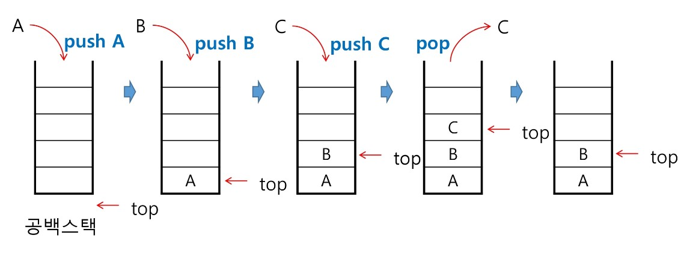

# List1


[toc]


## 스택

### 스택(stack)의 특정

- 물건을 쌓아 올리듯 자료를 쌓아 올린 형태의 자료구조

- 스택에 저장된 자료는 선형 구조
  - 선형구조 : 자료 간의 관계가 1대 1의 관계
  - 비선형구조 : 자료 간의 관계가 1대 N의 관계를 가짐(ex. 트리)
- 스택에 자료를 삽입하거나 스택에서 자료를 꺼낼 수 있음
- 후입선출(LIFO, Last-In-First-Out) : 마지막에 삽입한 자료를 가장 먼저 꺼냄
  - 1, 2, 3으로 삽입하면 3, 2, 1로 꺼낼 수 있음


### 스택의 구현

- 스택을 프로그램에서 구현하기 위해서 필요한 자료구조와 연산
  - 자료구조 : 자료를 선형으로 저장할 저장소
    - 배열을 사용할 수 있다
    - 저장소 자체를 스택이라 부르기도 한다
    - 스택에서 마지막 삽입된 원소의 위치를 top이라 부른다 (공식 명칭은 stack pointer )
  - 연산
    - 삽입(push) : 저장소에 자료를 저장
    - 삭제(pop) : 저장소에서 자료를 꺼냄. 삽입한 자료의 역순으로 꺼냄
    - isEmpty : 스택이 공백인지 아닌지를 확인하는 연산
    - peek : 스택의 top에 있는 item(원소)를 반환하는 연산(꺼내진 않고 확인만)


- 스택의 삽입 / 삭제 과정

  

push A

top += 1

그 자리에 A 저장

push B

top += 1

그 자리에 B 저장


### 스택의 push 알고리즘

- append 메소드를 통해 리스트의 마지막에 데이터를 삽입

  ```python
  def push(item):
      s.append(item)	# apeend는 느림
  ```

  ```python
  def push(item, size):
      global top
      top += 1
      if top == size:
          print('overflow!')	# 디버깅용. 실제 문제에선 필요 x
      else:
          stack[top] = item
          
  size = 10
  stack = [0] * size
  top = -1
  
  push(10, size)
  top += 1			# push(20)
  stack[top] = 20
  ```

  

### 스택의 pop 알고리즘

```python
def pop():
    if len(s) == 0:
        # underflow
        return
    else:
        return s.pop(-1);
```

```python
def pop():
    global top
    if top == -1:
        print('underflow')
        return 0
    else:
        top -= 1
        return stactk[top+1]	# 이 위치에 저장한 값 아직 남아있지만 push하면 덮어쓰게 됨
print(pop())

if top > -1:			# pop() . if문은 잘 안쓰긴 함
    top -= 1
    print(stack[top+1])
```


### 스택 구현 고려 사항

- 1차원 배열을 사용하여 구현할 경우 

  - 장점 : 구현이 용이함

  - 단점 : 스택의 크기를 변경하기가 어려움

    -> 이를 해결하기 위한 방법 : 저장소를 동적으로 할당하여 스택을 수현하는 방법

    동적 연결리스트를 이용하여 구현하는 방법

    구현이 복잡 but, 메모리를 효율적으로 사용한다는 장점


### 스택의 응용1 : 괄호검사

- 괄호의 종류 :  대괄호, 중괄호, 소괄호

- 조건

  1. 왼쪽괄호의 개수와 오른쪽 괄호의 개수가 같아야함
  2. 같은 괄호에서 왼쪽 괄호는 오른쪽 괄호보다 먼저 나와야함
  3. 괄호 사이에는 포함관계만 존재

- 스택을 이용한 괄호 검사

  ```pseudocode
  if ( ( i == 0 ) && ( j == 0 )	# && = python의 and
  ```

- 괄호를 조사하는 알고리즘 개요

  - 왼쪽 괄호를 만나면 스택에 삽입, 오른쪽 괄호를 만나면 스택에서 top괄호를 삭제한 후 오른쪽 괄호와 짝이 맞는지 검사
  - 이 때, 스택이 비어있으면 조건 1 또는 조건 2에 위배. 괄호의 짝이 맞지 않으면 조건 3에 위배
  - 마지막 괄호까지를 조사한 후에도 스택에 괄호가 남아있으면 조건 1이 위배


### 스택의 응용2 :  function call

- Function call
  - 프로그램에서 함수 호출과 복귀에 따른 수행 순서를 관리
    - 가장 마지막에 호출된 함수가 가정 먼저 실행을 완료하고 복귀하는 후입선출 구조 -> 후입선출 구조의 스택을 이용하여 수행순서 관리
    - 함수 호출이 발생 -> 호출한 함수 수행에 필요한 지역변수, 매개변수 및 수행 후 복귀할 주소 등의 정보를 스택 프레임에 저장하여 시스템 스택에 삽입
    - 함수의 실행이 끝나면 시스템 스택의 top 원소(스택 프레임)를 삭제(pop)하면서 프레임에 저장되어 있던 복귀주소를 확인하고 복귀
    - 함수 호출과 복귀에 따라 이 과정을 반복하여 전체 프로그램 수행이 종료되면 시스템 스택은 공백 스택이 됨


## 재귀호출

- 자기 자신을 호출하여 순환 수행되는 것

- 함수에서 실행해야 하는 작업의 특성에 따라 일반적인 호출방식보다 재귀호출방식을 사용하여 함수를 만들면 프로그램의 크기를 줄이고 간단하게 작성

  ex)  factorial

  ```pseudocode
  n! = n x (n-1)!
  (n-1)! = (n-1) x (n-2)!
  ...
  2! = 2 x 1!
  1! = 1
  ```

  

- 피보나치 수열

  - 0, 1, 1, 2, 3, 5, 8, 13, ...

  - F0 = 0, F1 = 1

  - Fi = Fi-1 + Fi-2 for i >= 2

  - 피보나치 구하는 재귀함수

    ```python
    def fibo(n):
        if n < 2:
            return n
        else:
            return fibo(n-1) + fibo(n-2)


- 재귀함수 기본형 : `f(i, N): ` i는 현재, N은 목표

- A = 10, 20, 30 이고 N = 3일 때 재귀로 복사

  ```python
  def recur_copy(i, N):
      if i == N:
          return
      else:
          B[i] = A[i]
          recur_copy(i+1, N)
  
  A = [10, 20, 30]
  B = [0] * 3
  recur_copy(0, 3)
  print(B)
  ```

  


## Memoization & DP ❌

- 피보나치를 재귀함수로 구현했을 때 문제점 : 엄청난 중복 호출 존재

- 피보나치 수열의 Call Tree

  

### 메모이제이션(Memoization)

- 이전에 계산한 값을 메모리에 저장해서 매번 다시 계산하지 않도록

- 전체적인 실행속도를 빠르게 하는 기술

- 동적 계획법의 핵심이 되는 기술

- 피보나치

  ```python
  # memo를 위한 배열을 할당하고, 모두 0으로 초기화
  # memo[0]을 0으로, memo[1]는 1로 초기화
  
  def fibo1(n):
      global memo
      if n >= 2 and len(memo) <= n:
          memo.append(fibo1(n-1) + fibo1(n-2))
      return memo[n]
  
  memo = [0, 1]
  ```

  ```python
  def fibo1(n):
      if n >= 2 and memo[n] == 0:
          memo[n] = fibo(n-1) + fibo(n-2)
      return memo[n]
  
  
  memo = [0] * (n + 1)
  memo[0] = 0
  memo[1] = 1
  print(fibo(N))	# 55
  print(memo)		# [0, 1, 1, 2, 3, 5, 8, 13, 21, 34, 55]
  ```

  

### DP(Dynamic Programming)

- 동적 계획(Dynamic Programming) 알고리즘

  - 최적화 문제를 해결하는 알고리즘(그리디 알고리즘처럼)

- 먼저 입력 크기가 작은 부분 문제들을 모두 해결한 후에 그 해들을 이용하여 보다 큰 크기의 부분 문제들을 해결하여, 최종적으로 원래 주어진 입력의 문제를 해결하는 알고리즘

- 피보나치 수 DP 적용

  1. 문제를 부분 문제로 분할
     - fibo(n)은 fibo(n-1), fibo(n-2), ..., fibo(1), fibo(0)의 부분집합으로 나뉨
  2. 부분 문제로 나누는 일이 끝냈으면 가장 작은 부분 문제부터 해를 구한다
  3. 그 결과는 테이블에 저장하고, 테이블에 저장된 부분 문제의 해를 이용하여 상위 문제의 해를 구한다.

  ```python
  N = 10
  fibo = [0] * (N+1)
  fibo[0] = 0
  fibo[1] = 1
  for i in range(2, N+1):
      fibo[i] = fibo[i-1] + fibo[i-2]
  print(fibo)
  ```

  

- DP의 구현 방식
  - recursive 방식 : fib1() (정확히는 메모이제이션)
  - iterative 방식 : fib2()
- memoization을 재귀적 구조에 사용하는 것보다 반복적 구조로 DP를 구현한 것이 성능 면에서 보다 효율적
- 재귀적 구조는 내부에 시스템 호출 스택을 사용하는 오버헤드가 발생하기 때문


## DFS(깊이우선탐색)

- 비선형구조인 그래프 구조는 그래프로 표현된 모든 자료를 빠짐없이 검색하는 것이 중요
- 두가지 방법
  - 깊이 우선 탐색(Depth First Search, DFS)
    - 재귀 or 반복(스택 사용) -> 마지막 값 보겠다는 의미
  - 너비 우선 탐색(Breadth First Search, BFS)


## 간단 정리

자료구조

데이터를 효율적으로 저장하고 관리하기 위한 방법


데이터

경험이나 관찰로부터 얻어진 조직화된 정보의 모음


데이터는 어떻게 컴퓨터에 저장될까?

스토리지 

- 데이터가 영구히(컴퓨터 전원이 내려가도) 저장되는 곳
- HDD, SSD, USB, CD,...
- 용량이 크지만 속도가 느림
- 당장 필요한 데이터가 아닌 데이터

메모리

- 데이터가 임시적으로 저장되는 곳
- 용량이 작지만 속도가 매우 빠름
- 당장 필요한 데이터가 위치
- 메모리를 효율적으로 사용하자!
- 데이터가 저장되는 위치 random
- RAM(Random Access Memory)
- 각 칸마다 주소값이 지정되어 있음


데이터 타입(Data Type)

Patriot Missile 오류

User-defined data type

클래스(class)를 이용해서 나만의 데이터 타입을 선언


∴ 자료구조 : 컴퓨터의 메모리를 효율적으로 사용할 수 있도록 데이터를 저장하고 구성하는 방법


선형 자료구조 : 리스트, 스택, 큐, linked list

비선형 자료구조 : 그래프, 트리(그래프에 속함)


데이터에 맞는 자료구조

- 데이터를 표현하기 쉽고

- 데이터를 이해하기 쉽고

- 데이터를 활용하기도 쉽다


추상 데이터 타입(Abstract Data Type, ADT)

데이터가 가지고 있는 공통점

- 데이터가 가지고 있는 구조
- 데이터가 가지고 있는 연산


추상화(Abstraction)

특정한 대상이나 사람이나 상황이 아닌 일반적인 개념으로 만드는 것


스마트폰에서 자주 쓰이는 데이터 구조

- 개별적인 특징을 지우고
- 데이터 구조의 특징을 도출 -> 순서가 있는 나열된 구조
- 필요한 연산을 정의 -> 추가, 삭제, 수정


Abstrac Data Type

구조화된 데이터를 필요한 연산과 함께 묶어서 표현하는 방법

Abstract Data Type = Structured Data + Operation


스택 Stack

물건을 쌓아 올린 듯 자료를 쌓아 올린 형태의 자료 구조

1. 가장 마지막에 들어간 것이, 가장 처음에 나온다
   후입선출 LIFO(Last-In-First-Out)
2. 가장 위에서만 데이터의 삽입 & 삭제가 일어난다


- 구조 :  size(크기 구하기), top(마지막 원소의 위치) / items(`[]`)
  - top : 스택의 가장 위에 있는 위치를 저장하고 있는 데이터
  - size : 스택의 크기를 저장하고 있는 데이터
  - items : 스택에 담길 데이터를 저장 할 데이터 구조
- 연산 : pop(데이터 뽑아내기), push(값 넣기), is_pull, is_empty, peek
  - CreateStack : 스택을 생성하는 연산, size 필요
    - 왜 size가 필요한가?
      -> append는 파이썬이 알아서 size를 조절해줌
  - IsEmpty : 스택이 현재 비어있는지를 확인하는 연산, true, false 리턴
  - IsFull : 스택이 현재 꽉 차있는지를 확인하는 연산, true, false 리턴
  - Push : 스택에 새로운 데이터 요소를 삽입하는 연산
  - Pop : 스택에서 가장 위에 있는 요소를 제거하는 연산, 데이터 반환
  - Peek : 스택에서 가장 위에 있는 요소를 반환하는 연산(요소 제거x)